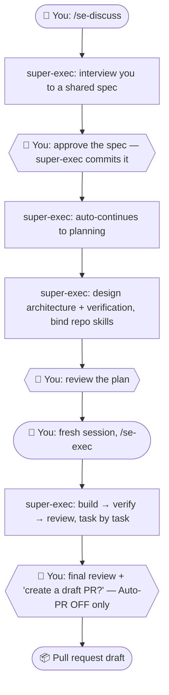

# super-exec

Complete workflow from vague idea to PR — less baby sitting, enforcing discipline at every stage,
adapt to your repo convention. Shipped as a plugin for Claude Code (and Cursor). It carries a feature
from **shared understanding → spec → plan → build → verify → review → PR**, while enforcing the
discipline you'd otherwise correct by hand: delegate heavy work to subagents, verify before claiming
done, stay in scope, reuse before writing, and respect each repo's own conventions.

You stay in control at every checkpoint. super-exec does the legwork in between.

---

## Install

super-exec is a plugin marketplace. Install it per repo:

```
/plugin marketplace add mek-earnin/super-exec
/plugin install super-exec
```

That's it — open a session in the target repo and super-exec orients you automatically.

### Optional dependencies (graceful — never required)

super-exec is **self-contained**. These make it nicer when present and are skipped silently when not:

| Install | When | What it adds |
|---|---|---|
| **impeccable** | You work on **UI** (frontend apps, components, styles) | Production-grade UI design direction, build (`craft`), and review (`critique`). Recommended if you touch UI. |
| **caveman** | You want terse, high-signal chat | Compresses the discuss interview's phrasing (keeps all substance). |

If neither is installed, super-exec runs the full workflow anyway and tells you what it skipped.

### If superpowers is also installed

super-exec and superpowers overlap — both try to drive feature work. Where they overlap (discuss / plan / build / verify / review / PR), super-exec asserts best-effort precedence: its workflow drives those steps, and superpowers stays available for what super-exec doesn't cover (e.g. debugging). No setup is needed for this to work.

**Optional:** To remove the overlap entirely, you can disable superpowers in projects where you use super-exec via `/plugin` or per-project settings. This is only a recommendation — super-exec works fine with superpowers left enabled. See ADR 0004 for the full coexistence rationale.

---

## The workflow, from your side

Two sessions, one hard boundary at **plan → build**.



During discuss, super-exec starts branch/ticket lookup in the background so the interview does not wait on git or Atlassian. After the WHAT is clear, it asks once for any missing Jira ticket and shows the proposed branch name. It writes the uncommitted spec file for your review. No branch is created and nothing is committed until you approve the spec; then it creates/switches to the confirmed branch, commits the approved artifacts, and continues into planning.

The **discuss → plan** hop is automatic: once you approve the spec, super-exec commits it and continues
straight into planning in the same session. The only hard boundary is **plan → build** — start `/se-exec`
in a fresh session. At build entry you set two toggles: *review before each commit?* and *Auto-PR?*
With *review before each commit?* **OFF**, that one choice is your standing go-ahead — the agent
commits each task automatically without stopping to ask. Pending human reviews still block commits
until you approve. The second is the "human in the loop?" switch — Auto-PR **ON** skips the
final review and opens the PR automatically; **OFF** stops for your work-review and asks whether to open
a draft PR (a "no" ends the session with no PR).

### Who does what

| 🧑 You give / decide | 🤖 super-exec automates |
|---|---|
| Run `/se-discuss`, `/se-plan`, `/se-exec` | Researches the codebase via subagents (instead of asking) |
| Answer the interview (the **WHAT**) | Drafts the spec to a fixed template; sharpens terms |
| Resolve open questions in planning (the **HOW**) | Designs architecture + verification |
| Confirm the ticket / branch once during discuss | Creates the confirmed branch only after spec approval |
| **Review + approve** the spec & plan | Commits the spec; implements each task in subagents |
| Set 2 toggles once (review before each commit? Auto-PR?) | Verifies with real evidence (runner runs it, a strong model judges) |
| **Review** the work at the final checkpoint (Auto-PR OFF) | Reviews its own code, fixes, commits, then opens the PR draft |

The heavy, context-burning work (builds, tests, searches, reviews) runs in throwaway subagents — your
session stays lean. Nothing claims "done" without shown evidence, and nothing commits while a human
review is pending.

---

## What's in the box

**Three things you invoke** (type `/name`, or just describe the work and the model picks it up):

| Tool | What it does | When to use |
|---|---|---|
| **`/se-discuss`** | Design session. Interviews you to a shared spec (the WHAT only), with a docs-review checkpoint. | Starting a new feature or changing behavior. |
| **`/se-plan`** | Plan session. Turns a committed spec into an architecture + verification plan; binds repo skills to tasks. Also re-enters an existing plan. | After a spec is committed, or to re-plan. |
| **`/se-exec`** | Build session. Runs the execute→verify→review loops task by task, then opens the PR. Resumes from a handoff if context ran out. | After a plan is reviewed. Start in a fresh session. |

**Helpers it runs for you** (you don't invoke these directly):

| Skill | Role |
|---|---|
| `se-verify` | Inner loop — runs the baseline + task verification and judges the evidence against spec + plan. |
| `se-review` | Outer loop — architecture review → deep review (data-flow → reuse → consistency) → severity-tagged findings, with a realism filter. |
| `se-pr` | PR creation only (the final review checkpoint lives in se-exec). Delegates to the repo's `create-pr` skill, or mirrors `pull_request_template.md`. |
| `se-handoff` | Writes a resume handoff when the build session approaches its context limit. |

Each skill keeps its bulky bits in sibling files it reads on demand — `branch-gate`, `branch-context`, `worktree`, and the
spec / plan / PR / handoff templates. Skills are written in Claude Code language; Cursor users get a single
one-way CC→Cursor translation table at `using-super-exec/references/cursor-tools.md`, which the SessionStart
hook injects into context on Cursor so every subagent runs on an explicit model slug chosen by tier (the
non-fast Composer for cheap/mid work, the strongest high-effort reasoning model for strong) instead of
inheriting the session model.

---

## Conventions: your repo always wins

For anything convention-bearing (branch, commit, PR, verification), super-exec follows **your repo's
own skill first** (e.g. `git-new-branch`, `git-commit-message`, `create-pr`), then a detected repo
pattern, then its own built-in default. It ships complete defaults so it works in a bare repo — but a
repo with opinions overrides them, every time. Drop-in, no configuration.

---

## Where things live

| Artifact | Location | Committed? |
|---|---|---|
| Spec | `docs/specs/<feature>.md` | yes (you commit it at spec approval) |
| ADR / glossary | `docs/adr/…`, `CONTEXT.md` | yes, sparingly |
| Plan / handoff | `.super-exec/<feature>/<date>-<plan>/` | no — local, git-ignored |

Plans are local; teammates share only the spec. super-exec keeps `.super-exec/` out of git
automatically — every session the SessionStart hook lists it in your repo-local, **uncommitted**
`.git/info/exclude`, so nothing tool-specific ever lands in the team-shared `.gitignore`.
